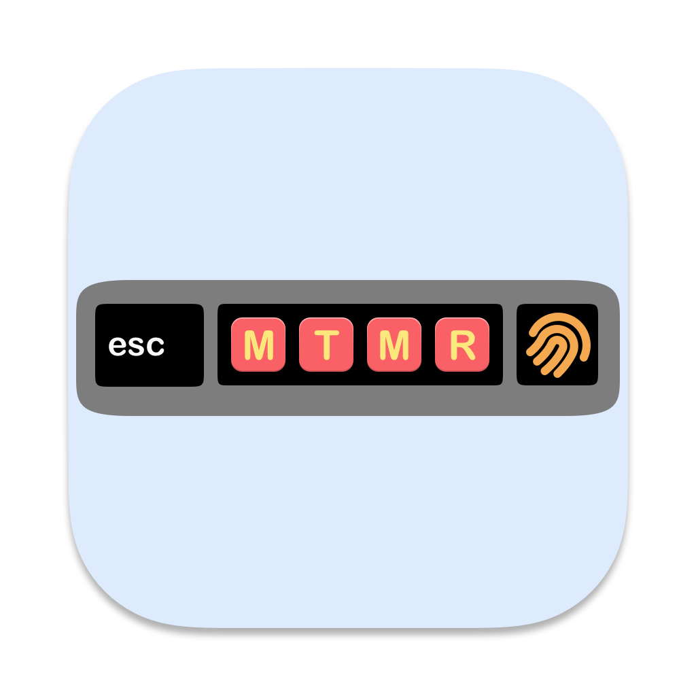

# MTMR-Codex



让带 Touch Bar 的 MacBook Pro 直接显示当前 Codex 账号的 5 小时额度、7 天额度、
使用进度和重置倒计时。

[下载最新版](https://github.com/Ward-Ge/MTMR-Codex/releases/latest) ·
[安装说明](INSTALL.md) ·
[原版 MTMR](https://github.com/Toxblh/MTMR)

## 使用效果

<p align="center">
  <a href="Resources/screenshots/codex-touch-bar.png">
    
  </a>
</p>

上图为 Intel Touch Bar Mac 的实际运行截图：第一行显示 5 小时额度，第二行显示
7 天额度；彩色进度条后依次为剩余额度和重置倒计时。点击图片可查看原始尺寸。

## 这个版本做了什么

本仓库是 Ward-Ge 基于开源项目 [Toxblh/MTMR](https://github.com/Toxblh/MTMR)
制作的用途定制版。它保留 MTMR 的 Touch Bar 自定义能力，并重点加入：

- 在 Touch Bar 同时显示 Codex 5 小时和 7 天额度；
- 显示使用进度、剩余额度和下一次重置时间；
- 默认每 60 秒自动刷新，可从系统菜单栏按秒自定义刷新间隔；网络失败时保留上一次有效结果；
- 使用 Codex 官方 App Server 登录流程，不读取或复制用户 Token；
- 自动清理本项目旧版遗留的 Python 刷新脚本和 LaunchAgent；
- 可按机型显示虚拟 Esc，并支持隐藏顶部菜单栏图标；
- 提供 Intel 与 Apple Silicon 通用安装包。

从 1.1.0 开始，安装包不再内置体积较大的 Codex App Server。MTMR-Codex 会使用
用户电脑上已有的 Codex，安装包因此缩小到约 1 MB。

## 使用要求

- 一台配有 Touch Bar 的 MacBook Pro；
- macOS 11 或更高版本；
- 已安装并登录 Codex App、ChatGPT App，或
  [Codex CLI](https://learn.chatgpt.com/docs/codex/cli)。

支持 Intel Touch Bar 机型，也支持带 Touch Bar 的 13 英寸 M1/M2 MacBook Pro。

## 安装

1. 从 [GitHub Releases](https://github.com/Ward-Ge/MTMR-Codex/releases/latest)
   下载 `MTMR-Codex-*-macOS-universal.dmg`。
2. 打开 DMG，把 `MTMR.app` 拖入“应用程序”。
3. 第一次启动时，按 [安装说明](INSTALL.md) 完成“仍要打开”和辅助功能授权。
4. MTMR 会自动查找已安装并登录的 Codex、ChatGPT App 或 Codex CLI。

## 配置 Touch Bar

配置文件位于：

```text
~/Library/Application Support/MTMR/items.json
```

本项目仍兼容原版 MTMR 的按钮、脚本、手势和小组件配置。完整配置参考请查看
[原版文档](https://github.com/Toxblh/MTMR#customization)，也可以浏览
[社区 Presets](https://github.com/Toxblh/MTMR-presets)。

## 本地构建

安装 Xcode 后，在项目根目录运行：

```bash
./scripts/package-free.sh
```

脚本会在 `Release/` 生成通用 DMG 和 ZIP，不会下载或内置 Codex Helper。

## 原项目与致谢

MTMR（My TouchBar My Rules）由
[Anton Palgunov（Toxblh）](https://github.com/Toxblh) 创建。本定制版保留原项目
版权声明和 [MIT License](LICENSE)。Touch Bar 自定义功能及其大部分实现来自原项目
及原项目贡献者；Codex 额度显示和轻量发布流程是本分支的定制改造。

- 原项目：[Toxblh/MTMR](https://github.com/Toxblh/MTMR)
- 原版配置设计器：[MTMR Designer](https://josmanvis.github.io/mtmr-designer/)
- 支持原作者：[Toxblh GitHub Sponsors](https://github.com/sponsors/Toxblh)
